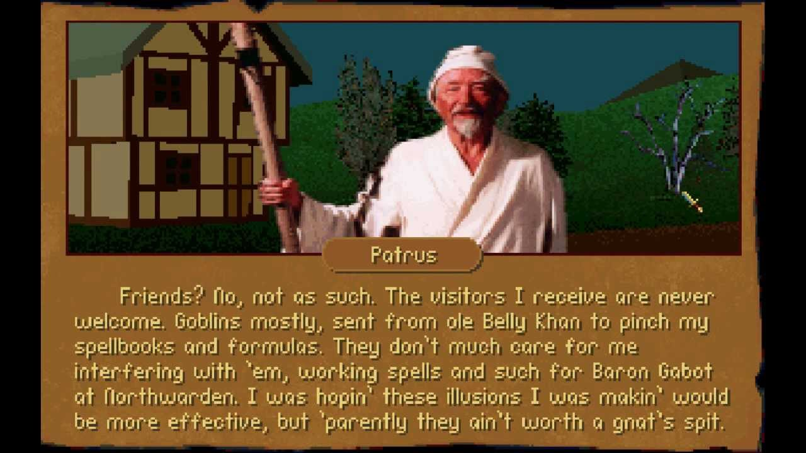

# Patrus



A punt on Colin's favorite book ["Crafting Interpreters"](https://craftinginterpreters.com/contents.html) but in Haskell

## Notes

[Syntax and Lexical Grammar Appendix](https://craftinginterpreters.com/appendix-i.html)

```
Hécate — Today at 1:29 AM
@adpx take some inspiration for Megaparsec here ~>https://github.com/kleidukos/Intrigue
and Diehl I think made  some stuff in Megaparsec in his tutorials
but do start with Alex/Happy
```

## Deps

Alex & Happy

```
$ cabal install alex happy
```

Lexer largely modeled off of this [tut](https://github.com/cse130-sp18/arith/blob/master/src/Language/Arith/Lexer.x).

## TODOS

First pass on "A Tree-walk interpreter" in Literal Haskell Style w/ Alex/Happy to see the presentation flow. See [Patrus.lhs](Patrus.lhs) for notes as I go along.

Git submodule a fork of just [the Lox tests](https://github.com/munificent/craftinginterpreters/tree/master/test).

Put all the code into their respective files after first pass.

Oh wow, read through Diehl's [Alex bit](http://dev.stephendiehl.com/fun/008_extended_parser.html) carefully